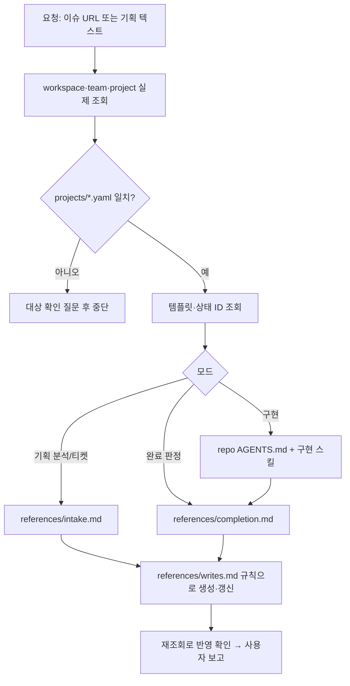

# 03. linear-delivery 스킬

목표: 초안 `linear-delivery/SKILL.md`에서 ARK Point 고정값을 분리하고, 단계별 reference로 나누며, Linear 쓰기의 멱등성과 상태 매핑을 코드로 검사 가능한 형태로 정의한다.

## 1. 파일 구성 (gisul-skills)

```text
skills/linear-delivery/
├── SKILL.md                      # 범위, 모드 선택, 프로젝트 정책 발견, 공통 불변 조건 (≤ 60줄)
└── references/
    ├── intake.md                 # 기획 → 확정 요구/미결정 질문 → 개발 티켓
    ├── completion.md             # 구현 근거 → 상태 매핑 → 닫기
    └── writes.md                 # 조회-후-쓰기, 타임아웃 재조회, 재읽기 확인
projects/arkpoint.yaml
policies/arkpoint-delivery.md     # 완료 정의·검토 규칙 원본 (Linear 프로젝트 문서로 옮기면 yaml의 policy_uri만 바꿈)
```

SKILL.md 본문에서 빠지는 것: workspace/team/project 이름, 템플릿 이름, Slack 채널 ID. 모두 `projects/arkpoint.yaml`로 간다.

## 2. `projects/arkpoint.yaml` 스키마

```yaml
key: arkpoint
linear:
  workspace: IYEN
  team: IYEN Development
  project: arkpoint-studio
  templates:
    implementation: 개발 작업
    decision: 기획 결정
  states:                      # 팀 상태 이름 → 스킬 내부 단계. ID는 실행 시 조회
    todo: Todo
    in_progress: In Progress
    in_review: In Review
    verifying: Verifying       # 배포 후 실사용 검증 대기. 팀에 없으면 사용자 결정 필요
    done: Done
    canceled: Canceled
notifications:
  slack:
    allowed_channels: [{ name: "#tf-arkpoint-dev", id: C0BBR6TNSCR }]
    forbidden_channels: ["#eum-협업", "#eum협업"]
    manual_send: never          # 이슈 갱신 외 수동 발송 금지
repos:
  - name: eum-content-studio
    url: https://github.com/…     # 사용자 확인 필요
    agents_md: AGENTS.md
policy_uri: skill://gisul/gisul/linear-delivery/../../policies/arkpoint-delivery.md   # 실제로는 resources URI로 표기
```

스킬은 이슈 URL → API로 workspace·team·project 조회 → `projects/*.yaml` 중 `linear.workspace`·`project`가 일치하는 항목 선택. 일치가 없으면 비슷한 이름을 쓰지 않고 사용자에게 대상만 확인한다.

## 3. 흐름



## 4. 멱등 쓰기 규칙 (`references/writes.md`)

- 생성 전 검색 키: `(project, 정규화된 제목)` + 원본 기획 이슈와의 관계. 정규화는 공백·괄호·조사 제거 후 소문자.
- 쓰기 타임아웃·5xx 후에는 **재시도 전에** 검색 키로 재조회한다. 존재하면 갱신으로 전환.
- 생성·갱신 후 `issue(id)`를 다시 읽어 project, template 적용 결과(라벨·설명 골격), 관계, 상태, 저장된 Markdown 렌더링을 확인한다. 실패 항목이 있으면 "부분 반영"으로 보고한다.
- 상태 전환은 `states` 매핑의 이름으로 ID를 조회해 사용한다. 이름이 팀에 없으면 전환하지 않고 보고한다.
- 한 실행에서 같은 이슈에 대한 쓰기는 최대 3회. 초과 시 중단하고 오류 원문을 보고.

## 5. 완료 매핑 (`references/completion.md`)

| 근거 상태 | 전환 대상 |
| --- | --- |
| 구현 완료, 검증 미완 | in_review |
| 검증 완료, 배포 전 | in_review (배포가 범위 밖이면 done + "배포 별도" 기록) |
| 배포 완료, 실사용 검증 대기 | verifying |
| 실사용 검증 완료 | done |
| 취소·중복 | canceled + 대체 이슈 링크 |

Linear GitHub 연동이 PR 병합을 자동으로 Done에 매핑하면 `verifying` 단계와 충돌한다. 07번의 사용자 결정 항목으로 넘긴다.

## 6. 평가 사례 (05번 하네스 입력)

| id | 입력 | 기대 |
| --- | --- | --- |
| L-01 | 권한 정책 미결정이 있는 기획 | `기획 결정` 이슈에 번호 질문, 독립 개발 티켓만 생성 |
| L-02 | 동일 기능 이슈가 이미 존재 | 신규 생성 없음, 기존 갱신·연결 |
| L-03 | 배포됐지만 실사용 검증 남음 | done으로 닫지 않음, verifying |
| L-04 | 기획 결정만 끝난 상태 | 기획 이슈는 닫고 개발 이슈는 유지 |
| L-05 | 완료 직전 요구 변경 댓글 | 최신 댓글 반영 후 판정 |
| L-06 | 자동 Slack 알림이 있는 프로젝트 | 수동 알림 없음 |
| L-07 | 다른 workspace의 이슈 URL | projects 불일치 → 대상 확인 질문 |
| L-08 | 쓰기 타임아웃 fixture | 재조회 후 중복 생성 없음 |

모두 Linear를 **녹화 fixture**로 대체한 읽기 전용 모드에서 채점한다(05번 3절).

## 7. 수용 기준

- [ ] SKILL.md에 워크스페이스·채널 ID 문자열이 없다 (`grep -c C0BBR6TNSCR` = 0).
- [ ] L-01~L-08 전부 baseline 이상, L-02·L-08 중복 생성 0.
- [ ] 기존 전역 AGENTS.md의 Linear 절을 삭제한 뒤에도 L-06 통과.
