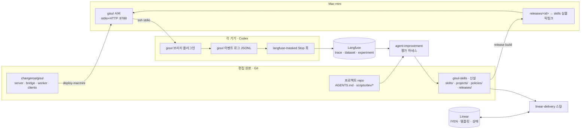

# 에이전트 환경 개발 설계 묶음

2026-09-16. dev pane(Codex, `~/tmp`)이 작성한 제안서 6편과 스킬 초안 2개를 읽고, 로컬 환경(`~/.codex`, `~/dev-tools/gisul`, 플러그인 캐시)을 추가로 조사해 **구현 가능한 설계**로 옮긴 문서다. 제안서는 "무엇을 해야 하는가"를 다뤘고, 이 묶음은 "정확히 어떤 파일·인터페이스·순서로 만드는가"를 다룬다.

## 제안서 대비 새로 확인한 사실

| 사실 | 근거 | 설계에 미치는 영향 |
| --- | --- | --- |
| gisul 서버·브리지·워커 코드의 Git 원본은 **이미 존재**한다: `github.com/changeroa/gisul`, 로컬 클론 `~/dev-tools/gisul`(main `f80ff98`) | `git remote -v`, `git log` | 감사 보고서의 "원본 저장소 미확인"은 **스킬 콘텐츠**에만 해당한다. 코드 SSOT는 확정됐고, 콘텐츠 SSOT만 새로 만든다 |
| Mac mini 배포본과 Codex 플러그인 캐시(`0.1.0+codex.20260908084946`)는 로컬 main보다 **2커밋 뒤**다 (offset 페이지네이션 없음) | `diff server/src/codex.ts`, 플러그인 `codex.mjs`에 `nextOffset` 0건 | 배포 파이프라인이 없어서 생긴 드리프트. 01번 설계의 첫 작업 |
| 로컬 클론이 두 개다: `~/dev-tools/gisul`(최신), `~/projects/eum-content-studio/dev-tools/gisul`(`5b218d5`, 3커밋 뒤) | `git log -1` | 편집 원본은 `~/dev-tools/gisul` 하나로 고정하고 다른 클론은 제거 후보 |
| 전역 AGENTS.md는 코드 도구 규칙, Herdr 감시 지시(대문자), worktree 정리, ARK Point Linear 고정값을 담고 있다 (4,148 bytes) | `~/.codex/AGENTS.md` | 02번 설계에서 Linear 절은 스킬+프로젝트 참조로, Herdr는 `herdr --skill`로 이관 |
| Langfuse 전송은 `langfuse-masked@personal` 플러그인의 **Stop 훅 1개**가 담당한다. 원본 `tracing@codex-observability-plugin` 훅 상태도 config에 남아 있다 | `hooks.json`, `config.toml` hooks.state | 중복 trace 원인 후보 1순위. 04번 설계에서 멱등 trace id로 해결 |
| gisul 로더 스킬은 `~/.codex/skills/gisul/SKILL.md`로 설치되며 description이 "gisul을 언급했을 때"에 치우쳐 있다 | `clients/codex/gisul/SKILL.md` | 02번 설계에서 description 재작성 |

## 시스템 지도

## 문서 목록과 의존 순서

| 번호 | 문서 | 만드는 것 | 선행 |
| --- | --- | --- | --- |
| 01 | [gisul SSOT · 서버 · 브리지 · 배포](01-gisul-ssot-server-bridge.md) | 스킬 콘텐츠 Git 저장소, release 스냅샷, URI 호환, 서버 캐시, 브리지 재연결·이벤트 로그, Mac mini 배포 스크립트 | 없음 |
| 02 | [지침 계층과 bootstrap](02-instruction-layering-bootstrap.md) | 짧은 전역 AGENTS.md, 로더 description, 프로젝트 참조 파일, 시작 토큰 측정 | 01 (로더가 release를 읽음) |
| 03 | [linear-delivery 스킬](03-linear-delivery-skill.md) | 진입점 + intake/completion 참조 + `projects/arkpoint.yaml`, 상태 매핑, 멱등 쓰기 | 01, 02 |
| 04 | [관측: trace 스키마와 exporter](04-observability-trace-schema.md) | 멱등 trace id, 최상위 입출력 채움, context manifest 메타데이터, gisul 이벤트 조인 | 01 (이벤트 로그) |
| 05 | [평가 하네스와 agent-improvement](05-evaluation-harness.md) | 사례집 스키마, baseline/candidate runner, 채점기, 승격 정책, 예약 분석 | 01, 04 |
| 06 | [프로젝트 실행 경로](06-project-runtime-readiness.md) | `ensure-ready`, `verify-flow`, `.agent-runtime/` 계약 (대표 프로젝트: eum-content-studio) | 없음 (독립) |
| 07 | [롤아웃과 검증](07-rollout-verification.md) | 단계별 게이트, 3기기 확인 절차, 위험, 사용자 결정 목록 | 전체 |

01과 06은 서로 독립이라 병렬로 시작할 수 있다. 02·03은 01의 release 개념 위에 올라가고, 05는 04의 메타데이터가 있어야 비교가 가능하다.

## 전체 완료 정의

1. fresh Codex 세션이 새 전역 지침만으로 `linear-delivery`를 gisul에서 찾아 로드하고, 로드된 release·digest가 trace 메타데이터에 남는다.
2. Mac mini의 서빙 스냅샷은 `gisul-skills` 저장소의 특정 commit에서 생성됐고, 심볼릭링크 교체로 롤백된다.
3. 9월 15일 사례를 포함한 사례집으로 baseline/candidate 비교가 Langfuse experiment로 기록된다.
4. 대표 프로젝트에서 `ensure-ready` 출력만으로 계정·서버·로그 위치를 알 수 있고, `verify-flow login-no-interstitial`이 통과한다.

## 이 묶음이 하지 않는 것

- 서버·플러그인·Linear·Langfuse의 실제 변경. 모든 문서는 설계이며 적용은 07번의 게이트를 따른다.
- Amp의 Orbs 같은 원격 실행 플랫폼, 벡터 검색, 자동 승격. 측정된 필요가 생길 때 별도 설계한다.
